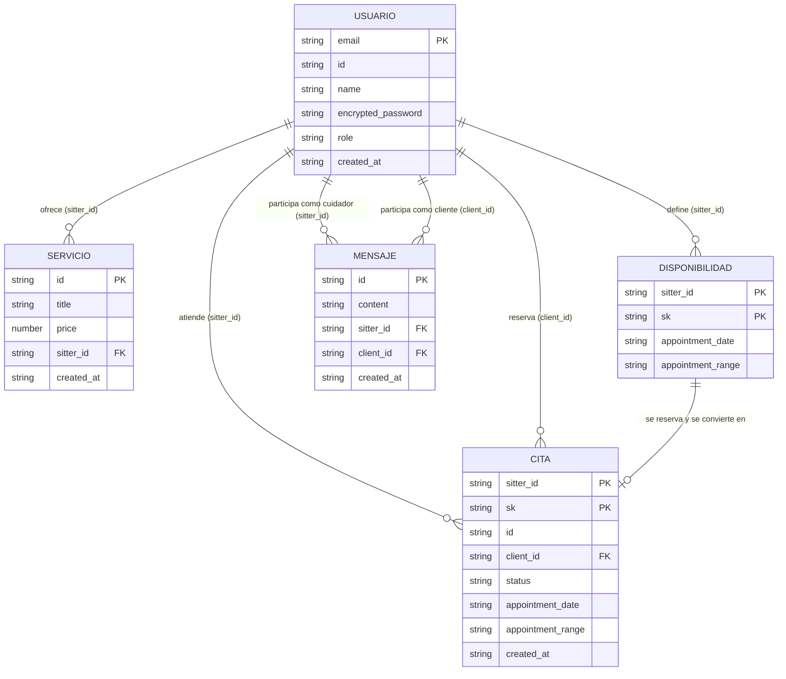

# Modelo de datos — DoggoApp

## Introducción

Este capítulo presenta el modelo de datos que estructura la información dentro del aplicativo DoggoApp: se describen las entidades principales, sus atributos y las relaciones entre ellas mediante un diagrama entidad-relación, y se explica cómo este modelo respalda las funcionalidades definidas en las historias de usuario, garantizando la integridad, consistencia y escalabilidad de los datos.

---

## Entidades principales

### Usuario
Representa tanto a un cliente que contrata servicios de cuidado como a un cuidador ("sitter") que los ofrece — ambos son la misma entidad, diferenciada por el atributo `role`.

| Atributo | Tipo | Descripción |
|---|---|---|
| `email` | String | Identificador único del usuario (partition key en `doggo-users`). |
| `id` | String (UUID) | Identificador interno, generado al registrarse; es el valor que referencian el resto de entidades como `sitter_id`/`client_id`. |
| `name` | String | Nombre completo. |
| `encrypted_password` | String | Hash bcrypt de la contraseña (nunca se guarda en texto plano). |
| `role` | String | `"user"` (cliente) o `"sitter"` (cuidador). |
| `created_at` | String | Fecha de creación. |

Tabla física: `doggo-users`.

### Servicio
Un servicio de cuidado ofrecido por un cuidador (paseo, hospedaje, baño, etc.), con un precio fijo.

| Atributo | Tipo | Descripción |
|---|---|---|
| `id` | String (UUID) | Identificador único del servicio. |
| `title` | String | Nombre del servicio (ej. "Paseo"). |
| `price` | Number | Precio del servicio. |
| `sitter_id` | String (UUID) | Referencia al `id` del Usuario (cuidador) que lo ofrece. |
| `created_at` | String | Fecha de creación. |

Tabla física: `doggo-services`.

### Disponibilidad (slot)
Un horario abierto que un cuidador ofrece para ser reservado. Al reservarse, deja de existir como disponibilidad y se convierte en una Cita.

| Atributo | Tipo | Descripción |
|---|---|---|
| `sitter_id` | String (UUID) | Referencia al Usuario (cuidador) dueño del horario. |
| `appointment_date` | String (`YYYY-MM-DD`) | Fecha del horario disponible. |
| `appointment_range` | String | Rango horario (ej. `"08:00-12:00"`). |

Tabla física: `doggo-schedule` (item con `sk` de la forma `SLOT#<appointment_date>#<appointment_range>`).

### Cita (appointment)
Una reserva confirmada entre un cliente y un cuidador, para un horario que antes era una Disponibilidad.

| Atributo | Tipo | Descripción |
|---|---|---|
| `id` | String (UUID) | Identificador único de la cita. |
| `sitter_id` | String (UUID) | Referencia al Usuario (cuidador) que atiende. |
| `client_id` | String (UUID) | Referencia al Usuario (cliente) que reservó. |
| `status` | String | Estado de la cita (`"Agendada"` al crearse). |
| `appointment_date` | String (`YYYY-MM-DD`) | Fecha reservada. |
| `appointment_range` | String | Rango horario reservado. |
| `created_at` | String | Fecha en que se confirmó la reserva. |

Tabla física: `doggo-schedule` (item con `sk` de la forma `APPOINTMENT#<id>`, misma tabla que las Disponibilidades — ver Integridad más abajo).

### Mensaje
Un mensaje de texto dentro de una conversación entre un cliente y un cuidador (para coordinar un servicio, resolver dudas, etc.).

| Atributo | Tipo | Descripción |
|---|---|---|
| `id` | String (UUID) | Identificador único del mensaje. |
| `content` | String | Contenido del mensaje. |
| `sitter_id` | String (UUID) | Referencia al Usuario (cuidador) participante. |
| `client_id` | String (UUID) | Referencia al Usuario (cliente) participante. |
| `created_at` | String | Fecha de envío. |

Tabla física: `doggo-message`.

---

## Relaciones entre entidades

- **Usuario (sitter) → Servicio**: un cuidador puede ofrecer varios servicios; cada servicio pertenece a un único cuidador (**1 : N**).
- **Usuario (sitter) → Disponibilidad**: un cuidador define varios horarios abiertos; cada horario pertenece a un único cuidador (**1 : N**).
- **Disponibilidad → Cita**: una Disponibilidad se reserva y se transforma en una Cita (relación de transición 1:1 — al confirmarse, el slot se elimina y nace la cita en la misma operación atómica).
- **Usuario (sitter) → Cita** y **Usuario (client) → Cita**: cada cita involucra exactamente a un cuidador y a un cliente; un usuario (en cualquiera de los dos roles) puede tener muchas citas (**1 : N** desde cada lado, es decir **N : M** entre clientes y cuidadores a través de la Cita).
- **Usuario (sitter) ↔ Usuario (client) → Mensaje**: cada mensaje conecta a un cliente y un cuidador; un mismo par puede intercambiar muchos mensajes (**1 : N** desde cada lado).

---

## Diagrama entidad-relación

> `DISPONIBILIDAD` y `CITA` son, en la práctica, la misma tabla física `doggo-schedule` — se separan en el diagrama porque son dos entidades conceptualmente distintas (una desaparece cuando nace la otra), aunque comparten partition key (`sitter_id`) y se diferencian por el prefijo de la sort key (`sk`).

---

## Cómo el modelo respalda las historias de usuario

| Historia de usuario | Entidad(es) involucradas | Endpoint | Tabla |
|---|---|---|---|
| Como usuario, quiero registrarme con mi correo y contraseña para poder usar la app. | Usuario | `POST /register` | `doggo-users` |
| Como usuario, quiero iniciar sesión para obtener un token de acceso. | Usuario | `POST /login` | `doggo-users` |
| Como cliente, quiero ver la lista de cuidadores disponibles para elegir uno. | Usuario (role=sitter) | `GET /sitters` | `doggo-users` (GSI `role-index`) |
| Como cliente, quiero ver el catálogo de servicios que ofrecen los cuidadores. | Servicio | `GET /services` | `doggo-services` |
| Como cliente, quiero consultar los horarios disponibles de un cuidador antes de reservar. | Disponibilidad | `GET /schedule/{sitterId}` | `doggo-schedule` |
| Como cliente, quiero reservar una cita en un horario disponible de un cuidador. | Disponibilidad → Cita | `POST /schedule/{sitterId}` | `doggo-schedule` |
| Como cliente o cuidador, quiero enviar y leer mensajes para coordinar el servicio. | Mensaje | `GET /messages` / `POST /messages` | `doggo-message` |

Cada historia de usuario corresponde a una operación de lectura o escritura sobre una entidad concreta del modelo, resuelta con una única llamada a DynamoDB (`GetItem`, `Query`, `Scan`, `PutItem` o `TransactWriteItems` según el caso) — el modelo de datos está diseñado alrededor de los patrones de acceso que estas historias necesitan, no al revés, siguiendo la práctica recomendada de modelado en DynamoDB ("diseñar las tablas para las consultas, no para las entidades").

---

## Integridad, consistencia y escalabilidad

DynamoDB es una base de datos NoSQL sin esquema fijo ni claves foráneas: no existe un mecanismo nativo equivalente al `FOREIGN KEY ... REFERENCES` de una base relacional. El modelo compensa esto a nivel de diseño de tablas y de aplicación:

**Integridad**
- La unicidad del `email` en `doggo-users` (equivalente al antiguo `UNIQUE KEY` de MySQL) se garantiza con `ConditionExpression: attribute_not_exists(email)` en el `PutItem` de `register`, no con una restricción de esquema.
- La operación de reservar una cita (`POST /schedule/{sitterId}`) requiere borrar el slot de `doggo-schedule` y crear la cita como una sola unidad atómica — se resuelve con `transact_write_items` (`Delete` + `Put`), evitando que dos clientes reserven el mismo horario en una condición de carrera.
- La integridad referencial de `sitter_id`/`client_id` (que apunten a un Usuario real) **no se valida automáticamente** en ninguna de las funciones actuales — es una responsabilidad de la capa de aplicación que hoy no está implementada; ver la nota de seguridad ya documentada en `CLAUDE.md` sobre `sitter_id`/`client_id` confiados desde el body de la petición.

**Consistencia**
- Las lecturas (`get_item`, `query`, `scan`) usan por defecto consistencia eventual en DynamoDB (más económica) — ninguna función del backend fuerza `ConsistentRead=True`, así que, en teoría, una lectura inmediatamente después de una escritura podría no reflejarla todavía (ventana muy corta, normalmente milisegundos). Para el volumen y caso de uso de esta app no representa un problema práctico.
- `transact_write_items` sí ofrece consistencia fuerte "todo o nada" para la reserva de citas: o se aplican las dos operaciones (borrar slot + crear cita) o ninguna.

**Escalabilidad**
- Las 4 tablas usan facturación `PAY_PER_REQUEST` (on-demand): la capacidad escala automáticamente con el tráfico, sin necesidad de aprovisionar ni ajustar throughput manualmente.
- El diseño de partition key distribuye la carga: `email` en `doggo-users` y `sitter_id` en `doggo-schedule` reparten las operaciones entre particiones distintas por cada usuario/cuidador, evitando que un único hot partition concentre el tráfico de todos los usuarios.
- `doggo-services` y `doggo-message` usan `Scan` completo (sin filtrar) porque hoy no hay un patrón de acceso que lo requiera — es la opción más simple mientras el volumen de datos sea bajo; si creciera mucho, sería el primer punto a rediseñar (por ejemplo agregando una GSI por `sitter_id`/`client_id` para paginar en vez de escanear toda la tabla, como ya se hace en `doggo-message` a nivel de diseño potencial pero no implementado en el código actual).

---

## Referencias

- `backend/docs/aws-dynamodb-cli.md` — claves, índices y comandos de creación de las 4 tablas físicas.
- `backend/database/script.sql` — modelo relacional original (MySQL), histórico, ya no vigente.
- `CLAUDE.md` — notas de arquitectura y seguridad del backend.
